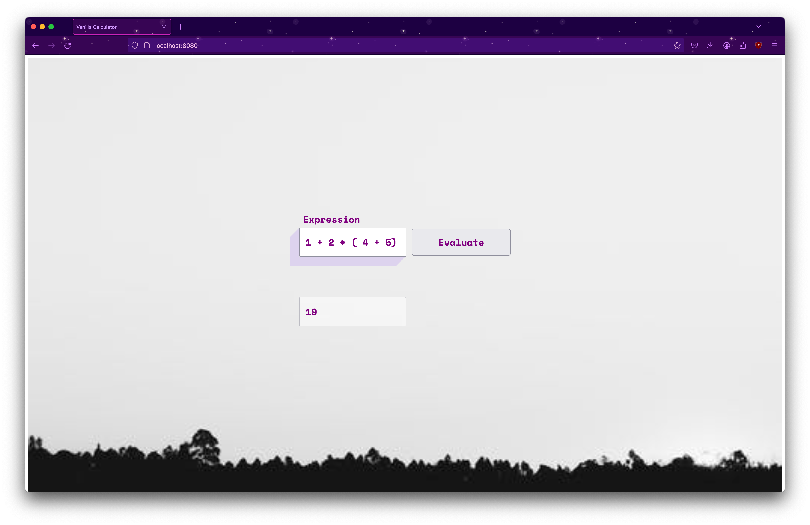

# vanilla-calculator

- Install http-server   
`npm i -g http-server`

- Run http-server in the root directory of this repo.
`http-server`

- Open localhost at port 8080 as specified by the http-server output

